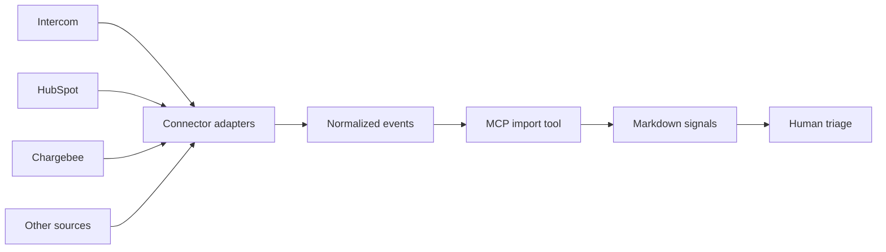

# Connector Architecture

Connectors convert external operational data into the hub's neutral `signal` format. External systems remain the source of raw records; the Markdown hub stores a small, anonymized observation plus a link and stable external reference.

## Boundary



The connector layer should not decide priority, create roadmap commitments, or publish customer claims.

## Normalized event

```json
{
  "externalId": "conversation-or-record-id",
  "summary": "An anonymized observation, not a raw transcript",
  "occurredAt": "2026-08-12T09:30:00Z",
  "url": "https://source-system.example/record/123",
  "domains": ["onboarding"],
  "tags": ["setup-friction"],
  "confidence": "medium"
}
```

The MCP tool combines `connector` and `externalId` into an immutable reference such as `intercom:123`. Re-importing that event is idempotent and returns the existing signal instead of duplicating it.

## Prototype support

The server currently provides:

- `neuphlo://connectors` to list connector capabilities and configuration status.
- `import_connector_events` to ingest up to 100 normalized events per call.
- Source URLs, connector tags, timestamps, and external IDs in signal frontmatter.
- Deduplication across repeat imports.

This means an export script, webhook receiver, ETL product, or agent can feed Intercom and HubSpot data today without placing API-specific logic inside the knowledge repository.

## Planned adapters

### Intercom

Potential inputs:

- closed conversations and their tags;
- conversation topics and teammate classification;
- recurring questions or friction by product area;
- links to the original conversation for authorized reviewers.

Raw message bodies and personal customer information should not be copied by default. The adapter should maintain a cursor, respect API rate limits, and redact before import.

### HubSpot

Potential inputs:

- structured deal objections and lost reasons;
- selected notes explicitly marked for product feedback;
- lifecycle or pipeline changes that indicate market patterns;
- company segment metadata needed to interpret a signal.

The adapter should use an explicit property allowlist. General CRM notes often contain sensitive or irrelevant material and should not be mirrored wholesale.

### Chargebee

Potential inputs:

- subscription activation, upgrade, downgrade, pause, reactivation, and cancellation events;
- structured cancellation reasons and selected customer feedback;
- plan or add-on movements that reveal adoption patterns;
- failed-payment or involuntary-churn trends when relevant to the product experience;
- aggregate revenue impact attached to a validated insight—not raw billing records in Markdown.

The adapter should avoid copying invoices, payment methods, addresses, tax identifiers, or full customer profiles. Customer and subscription identifiers should remain external references, and financial figures should default to aggregate or banded values unless a restricted workflow explicitly needs record-level amounts.

Recommended event mapping:

| Chargebee event | Hub interpretation |
|---|---|
| `subscription_created` | Adoption signal, usually aggregated before promotion |
| `subscription_changed` | Upgrade, downgrade, plan, or entitlement signal |
| `subscription_cancelled` | Churn signal with an allowlisted reason |
| `subscription_reactivated` | Recovery or regained-value signal |
| payment failure events | Operational friction trend, normally aggregated |

Chargebee API credentials require both `CHARGEBEE_SITE` and `CHARGEBEE_API_KEY`. They belong in the adapter service's secret store; the core MCP server only exposes configuration status during the prototype.

## Adapter contract

Each future live adapter should implement the same operational behavior:

1. Read a narrow, configured scope from the source API.
2. Resume from a durable cursor or modified timestamp.
3. Redact and normalize records before they cross into the hub.
4. Submit batches through the same idempotent import path.
5. Record counts, cursor, duration, and errors without logging secrets or raw sensitive text.
6. Retry rate limits and temporary failures without duplicating signals.

Adapters should run as separate Compose services or scheduled jobs. The MCP server itself remains useful without them and does not need broad external credentials.
