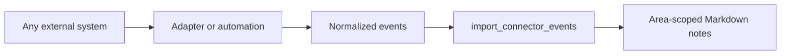

# Vendor-neutral event ingestion

The core server does not contain vendor SDKs, vendor credentials, or named-provider behavior. External adapters normalize selected source events and call `import_connector_events`.



Each event contains an external ID, summary, and optional timestamp, URL, and tags. The caller also supplies a connector identifier, destination area, owner, and sensitivity. The server combines the connector identifier and external ID into a stable reference, making retries idempotent.

```json
{
  "connector": "external-system",
  "area": "support",
  "owner": "automation",
  "sensitivity": "internal",
  "events": [
    {
      "externalId": "event-123",
      "summary": "A concise, approved observation.",
      "occurredAt": "2026-09-20T08:00:00Z",
      "url": "https://source.example/events/123",
      "tags": ["imported"]
    }
  ]
}
```

The authenticated principal must have write access to the destination area. Adapters should keep source credentials in their own secret store, minimize imported personal data, retain only durable context, and link back to the source when appropriate.

Adding an adapter does not require changes to the MCP server. Translate the external system's schema at the boundary and preserve this normalized contract.
