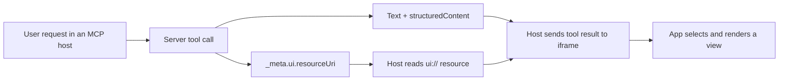

# Authoring MCP UI Views

This guide explains how to change the bundled MCP App or add a new result-specific view. The interface is rendered inline by compatible MCP hosts such as ChatGPT or Claude; it is not a standalone page returned directly from the `/mcp` endpoint.

## How the pieces fit together

An MCP App view requires three parts:

1. **A tool** returns text fallback plus structured data.
2. **Tool metadata** points to a `ui://` resource.
3. **The HTML app** receives the tool result and renders the appropriate component.



The starter uses one bundled HTML resource for multiple views:

- `view: "dashboard"` renders the example dashboard.
- `view: "knowledge-table"` renders an inline table.

Using a `view` discriminator keeps selection explicit and makes additional components easy to add.

## Relevant files

| File | Purpose |
|---|---|
| `app/index.html` | Semantic HTML structure for every included view |
| `app/src.ts` | MCP App connection, result types, event handling, and rendering |
| `app/style.css` | Responsive light/dark presentation |
| `src/server.ts` | MCP tool, resource, and structured-result registration |
| `vite.config.ts` | Builds one self-contained HTML file |
| `test/mcp-v2.test.ts` | Verifies tool metadata, UI resource retrieval, and result shape |

## Adjust the existing interface

### Change markup

Edit `app/index.html`. Preserve stable element IDs referenced from `app/src.ts`, or update the selectors in both places.

Keep the document self-contained. Do not add CDN scripts, remote fonts, images, or styles unless you also understand and intentionally extend the UI resource's CSP in `src/server.ts`.

### Change styling

Edit `app/style.css`. The starter already includes:

- light and dark theme variables;
- responsive breakpoints;
- horizontally scrollable tables;
- host-driven theme handling through `applyDocumentTheme()`.

Prefer the existing CSS variables so new components work in both themes:

```css
.example-card {
  border: 1px solid var(--line);
  border-radius: 14px;
  background: var(--panel);
  color: var(--ink);
}
```

The starter uses Neuphlo's current application palette: brand teal `#12b5a6`, highlight teal `#2bd4c3`, deep-teal foreground `#08201e`, and orange `#fe6e00`, with Neuphlo's light and dark neutral surfaces. Keep semantic variables such as `--accent`, `--accent-soft`, and `--warm` in component rules instead of repeating color values.

The informational page shown by a browser at `/mcp` is separate from the inline MCP App. Its matching color tokens live in the `browserHelp` CSS inside `src/index.ts`; update both locations if you intentionally rebrand the template.

### Change user-facing application name

Do not hard-code a customer's application name in HTML. Configure it in `.env`:

```env
MCP_APP_NAME=Customer Intelligence
```

The server returns that value in structured results, and the app applies it to visible headings and the document title.

## Add a new result-specific view

The following example adds a release-readiness card.

### 1. Define the structured result

In `app/src.ts`, add a type with a unique `view` value:

```ts
type ReleaseReadinessData = {
  view: "release-readiness";
  appName: string;
  release: {
    id: string;
    title: string;
    status: string;
    ready: boolean;
    checks: Array<{ label: string; complete: boolean }>;
  };
};
```

Add it to the view union:

```ts
type AppData = DashboardData | TableData | ReleaseReadinessData;
```

### 2. Add semantic HTML

Add a hidden section to `app/index.html`:

```html
<section id="release-view" class="shell" hidden>
  <p class="eyebrow">Release readiness</p>
  <h1 id="release-title"></h1>
  <div id="release-checks"></div>
</section>
```

The app should reveal only the section corresponding to the current result.

### 3. Add a renderer

In `app/src.ts`, create a renderer that treats all server-provided strings as untrusted:

```ts
function renderRelease(data: ReleaseReadinessData): void {
  hideAllViews();
  releaseView.hidden = false;
  releaseTitle.textContent = data.release.title;
  releaseChecks.innerHTML = data.release.checks
    .map(check => `<li>${escapeHtml(check.label)}: ${check.complete ? "Ready" : "Pending"}</li>`)
    .join("");
}
```

Prefer `textContent` where possible. When HTML generation is necessary, pass every external value through `escapeHtml()`.

Extend the central dispatcher:

```ts
function render(data: AppData): void {
  if (data.view === "knowledge-table") renderTable(data);
  else if (data.view === "release-readiness") renderRelease(data);
  else renderDashboard(data);
}
```

### 4. Register the server tool

In `src/server.ts`, attach the existing UI resource to the new tool:

```ts
server.registerTool(
  "show_release_readiness",
  {
    title: "Show release readiness",
    description: "Render a release-readiness card in a compatible MCP host.",
    inputSchema: z.object({ id: z.string() }),
    annotations: { readOnlyHint: true },
    _meta: { ui: { resourceUri: UI_RESOURCE_URI } },
  },
  async ({ id }) => {
    const release = await loadRelease(id);
    const structuredContent = {
      view: "release-readiness" as const,
      appName,
      release,
    };

    return {
      content: [{ type: "text", text: `${release.title}: ${release.status}` }],
      structuredContent,
    };
  },
);
```

Always return useful text in `content`. Hosts without MCP Apps support will display that fallback instead of the HTML component.

### 5. Add a protocol test

Extend `test/mcp-v2.test.ts` to verify:

```ts
const tools = await client.listTools();
const tool = tools.tools.find(item => item.name === "show_release_readiness");
assert.deepEqual(tool?._meta, {
  ui: { resourceUri: "ui://neuphlo/mcp-template/main.html" },
});

const result = await client.callTool({
  name: "show_release_readiness",
  arguments: { id: "REL-2026-001" },
});
assert.equal(result.structuredContent?.view, "release-readiness");
```

Tests should verify the server/UI contract, not just that HTML exists.

## Create a separate HTML app

Use a second `ui://` resource when a view has substantially different dependencies, security requirements, or lifecycle behavior. For a small card or table, reuse the existing resource.

To add a separate app:

1. Create another HTML entry and TypeScript entry under `app/`.
2. Update `vite.config.ts` to build it as a self-contained output.
3. Register a new URI, for example `ui://neuphlo/mcp-template/release.html`.
4. Return its bundled HTML through `server.registerResource()`.
5. Point the corresponding tool's `_meta.ui.resourceUri` to the new URI.
6. Add resource-discovery and MIME-type tests.

Every MCP App HTML resource must use:

```text
text/html;profile=mcp-app
```

## Calling MCP tools from the UI

The app calls tools through the host rather than fetching `/mcp` directly:

```ts
const result = await app.callServerTool({
  name: "submit_signal",
  arguments: {
    title: "Example",
    summary: "Observed behavior",
    sourceType: "internal",
    owner: "workspace-owner",
  },
});
```

This keeps authentication and authorization on the MCP server. The HTML interface must never be treated as an access-control boundary.

For UI-only helper tools, MCP Apps also supports tool visibility metadata. Use app-only tools sparingly; ordinary domain tools should usually remain available to both the model and app.

## Content Security Policy

The starter declares no external network or resource domains:

```ts
_meta: {
  ui: {
    csp: {
      connectDomains: [],
      resourceDomains: [],
    },
    prefersBorder: true,
  },
}
```

This is the safest default. If a view truly requires an external API or asset origin, allow only the exact HTTPS origin required. Never add broad wildcards merely to make development easier.

Sensitive data should be filtered before it enters `structuredContent`. Anything returned to the app may become visible in the host interface.

## Build and verify

Run the complete local checks:

```bash
npm run check
npm run build:ui
npm test
```

`npm run build:ui` produces:

```text
dist/ui/index.html
```

The JavaScript and CSS are inlined into that file. Do not edit `dist/`; it is generated from `app/`.

Rebuild the container after source changes:

```bash
docker compose up -d --build
npm run smoke
```

## Previewing and testing the UI

Opening `http://localhost:3000/mcp` shows only the server diagnostic because `/mcp` is the protocol endpoint. The real MCP App requires an MCP Apps-capable host to provide its initialization handshake, tool input, and tool result.

For visual development, a normal Vite preview can check static layout and responsive CSS, but host-driven tool calls will not function without an MCP Apps host. Final verification should therefore include:

1. tool discovery;
2. `_meta.ui.resourceUri` inspection;
3. `resources/read` of the `ui://` resource;
4. structured-result contract tests; and
5. rendering inside a compatible MCP host.

## Checklist

- [ ] The tool has a clear description telling the model when to use the view.
- [ ] The tool declares `_meta.ui.resourceUri`.
- [ ] The referenced `ui://` resource exists.
- [ ] The resource MIME type is `text/html;profile=mcp-app`.
- [ ] The result includes useful text fallback.
- [ ] `structuredContent` includes a stable `view` discriminator.
- [ ] The app handles empty, loading, read-only, and error states.
- [ ] External values are escaped or assigned through `textContent`.
- [ ] Server-side permissions filter data before it reaches the UI.
- [ ] CSP origins are minimal and explicit.
- [ ] Desktop, mobile, light, and dark layouts are checked.
- [ ] Protocol tests cover metadata, resource retrieval, and result shape.

## References

- [Official MCP Apps overview](https://modelcontextprotocol.io/extensions/apps/overview)
- [Official MCP Apps SDK and specification](https://github.com/modelcontextprotocol/ext-apps)
