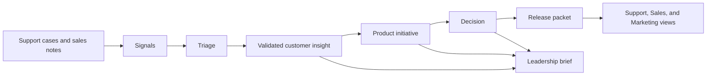

# Neuphlo MCP Template Blueprint

This document describes the opinionated knowledge-sharing example included with the Neuphlo MCP Template. It demonstrates resources, tools, prompts, MCP Apps, writes, and connectors; adopters can replace the domain model without changing the transport or container foundation.

## The problem to solve

Information currently travels through meetings, chat, tickets, CRM notes, support cases, and individual memory. Each function sees a different fragment:

- Support sees recurring pain but may not know roadmap context.
- Sales hears objections and demand but may overrepresent the loudest opportunities.
- Marketing needs positioning and timing but often learns about changes late.
- Product and Engineering need evidence, not repeated status requests.
- Leadership needs outcomes, risks, and decisions rather than raw activity.

The desired outcome is not a larger document archive. It is a shared organizational memory with clear ownership, predictable formats, and views suited to each audience.

## Design principles

1. **Write once, present many ways.** A decision or release has one canonical record; briefs link to it instead of copying it.
2. **Evidence before interpretation.** Raw signals remain distinguishable from validated insights and approved commitments.
3. **Pull details, push changes.** People can search deeply, while important changes surface in short digests.
4. **Human accountability.** An MCP client may draft, classify, link, and summarize; named humans own decisions and commitments.
5. **Markdown is the durable layer.** Agents, chat tools, dashboards, and models are replaceable interfaces.
6. **Progressive disclosure.** Every record starts with a small summary and links to evidence or deeper context.

## Communication objects

### Signal

A single observation: a support trend, sales objection, customer request, campaign response, delivery risk, or market event. Signals are intentionally low-friction and may be noisy.

Lifecycle: `new → triaged → linked | closed`

### Customer insight

A synthesized pattern supported by multiple signals or strong evidence. It states who experiences the issue, what outcome they seek, evidence strength, and implications. It is not automatically a roadmap commitment.

Lifecycle: `draft → validated → superseded`

### Decision

A record of a material choice, its owner, rationale, alternatives, consequences, and review date. Decisions prevent the same debate from restarting without new evidence.

Lifecycle: `proposed → accepted → superseded | reversed`

### Initiative

The current narrative for a body of work: intended outcome, target users, owner, health, milestones, risks, dependencies, linked insights, and linked decisions. This is not a task tracker.

Lifecycle: `discovery → planned → active → paused | complete | stopped`

### Release

A reusable communication packet containing the customer value, scope, availability, limitations, enablement material, support notes, and approved claims. Each team derives its communication from the same packet.

Lifecycle: `draft → ready → released → retired`

### Brief

A time-bound view assembled from canonical objects. A brief contains changes, implications, actions, and links—not copied source content.

## Role-specific views

| Audience | Default view | Important questions answered |
|---|---|---|
| Support | Releases, known limitations, linked issues, response guidance | What changed? Who is affected? What should we tell customers? |
| Sales | Customer value, qualification, objections, availability, approved claims | Who is this for? Can I promise it? How do I position it? |
| Marketing | Audience, narrative, proof, launch timing, constraints | What can we say, when, and with what evidence? |
| Product/Engineering | Insights, decisions, dependencies, risks | What evidence changed? What needs a decision? What is blocked? |
| Leadership | Outcomes, health changes, major risks, decisions, asks | Are outcomes moving? Where is intervention required? |

These are generated views over common records, not separate departmental documents.

## Proposed MCP V2 surface

The initial MCP server should be deliberately small.

### Resources

- `neuphlo://index` — navigation and recently changed records
- `neuphlo://records/{id}` — canonical example records
- `neuphlo://connectors` — connector catalog and configuration state

### Read tools

- `search_knowledge(query, types, teams, status, since)`
- `get_related(record_id, relationship_types)`
- `get_changes(since, audience)`
- `build_brief(audience, since, product_area)`

### Write tools

- `submit_signal(source, summary, evidence_links, sensitivity)`
- `propose_record(type, fields, links)`
- `propose_update(record_id, patch, reason)`
- `triage_signal(signal_id, outcome, links)`
- `validate_repository(scope)`

Writes should produce a reviewable proposal or pull request until governance is proven. Direct automated edits should be limited to low-risk derived content such as indexes and draft briefs.

### Prompts

- Turn support cases into anonymized signals.
- Compare recent sales objections with active initiatives.
- Prepare a release brief for Support, Sales, or Marketing.
- Summarize decisions and risks changed since the previous leadership review.
- Identify stale initiatives and records whose review date has passed.

## Metadata convention

Every canonical Markdown record uses YAML frontmatter. Shared fields:

```yaml
---
id: DEC-2026-001
type: decision
title: Example title
status: proposed
owner: person-or-team
created: 2026-08-12
updated: 2026-08-12
review_by: 2026-11-12
domains: [example]
audiences: [product, support, sales]
sensitivity: internal
tags: []
related: []
---
```

IDs and links remain stable if a file is renamed. `sensitivity` should begin with a small controlled vocabulary such as `internal`, `restricted`, and `public-approved`.

## End-to-end example



Example: Support logs repeated setup failures while Sales logs procurement objections. Triage keeps these as separate themes. The setup signals become a validated insight linked to an onboarding initiative. A scope decision records why one segment is prioritized. The resulting release packet gives Support troubleshooting notes, Sales qualification guidance, Marketing approved claims, and leadership the expected outcome and risk.

## Permissions and safety

- Read access is filtered by repository path and `sensitivity` metadata.
- Source-system identifiers may be stored, but raw personal or confidential customer content should not be copied into general records.
- Customer evidence should be summarized and anonymized by default.
- Only designated owners approve decisions, roadmap commitments, release claims, and public language.
- Every MCP write records actor, timestamp, client, and reason in Git history or an audit log.
- Derived summaries must link to canonical sources and show when they were generated.

## Implementation sequence

### Phase 1 — Workflow before software

- Use the templates manually with one example domain.
- Agree on owners, vocabulary, and review cadence.
- Measure retrieval time, duplicated questions, stale records, and adoption.

### Phase 2 — Read-only MCP

- Index Markdown and frontmatter.
- Expose resources, full-text search, relationships, and change feeds.
- Generate draft role briefs with citations back to files.

### Phase 3 — Controlled writes

- Add signal submission and proposed updates.
- Validate schema, links, permissions, and lifecycle transitions.
- Require human review for commitments and externally usable claims.

### Phase 4 — Source connectors

- Pull selected evidence from support, CRM, subscription/billing, analytics, issue tracking, and chat.
- Store references and summaries rather than duplicating sensitive raw data.
- Add notifications that point people back to canonical records.
- Keep API-specific adapters and secrets outside the core Markdown/MCP service; see [the connector architecture](connectors.md).

## Success measures

Use a small baseline and compare after the pilot:

- Median time to answer a cross-functional question.
- Percentage of material decisions with a durable record.
- Percentage of releases with complete Support, Sales, and Marketing readiness.
- Number of repeated status questions in meetings or chat.
- Age of active initiative updates and overdue review dates.
- Number of insights supported by multiple independent signals.
- Short pulse score: “I can find the current answer without asking someone.”

Do not optimize for file count, message volume, or number of generated summaries.

## Open design choices for the pilot

1. Where Git review happens and who can approve each record type.
2. Whether people author directly in Markdown or through forms/chat commands.
3. Which domain taxonomy and segmentation are canonical.
4. The boundary between internal, restricted, and public-approved information.
5. Which existing system owns delivery status versus customer-facing narrative.
6. The first example domain and named pilot steward.
